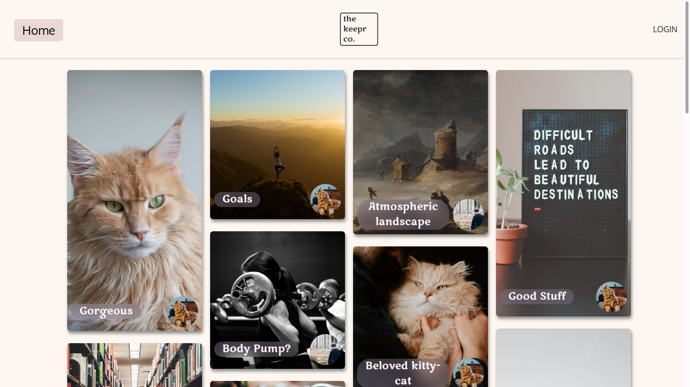

# Keepr

Keepr is a Pinterest style full-stack web application which allows users to visually share and explore new interests by adding images to personal collections.

[See Keepr live hosted here](https://keepr.corinnabolon.com)

## Technologies Used:
• Vue.js with Vue-Router for front-end development

• DotNet WebApi for server-side operations

• Auth0 integration for secure user management

• Dapper as the ORM for database interactions with MySQL

## Key Features:
Vaults and Keeps: Users can create custom Vaults, thematic collections that house their Keeps (images). This unique feature enables users to curate and share their interests in an organized manner.

Privacy Settings: Vaults can be marked as private, offering a personalized and secure space for users. Only the creator has access to private Vaults, ensuring a more intimate and personalized experience.

View and Save Count: Keepr acknowledges and displays the popularity of Keeps by showing view counts. Additionally, the 'Kept' count increments each time a user adds a Keep to their Vault, providing recognition for engaging content.

User Profiles: Every user has a public profile page, showcasing their Keeps and Vaults. This adds a social dimension, allowing users to explore and connect based on shared interests.

## What I learned from this project:
Through the development of Keepr, I deepened my understanding of C# and honed my skills in working with the .NET Framework. Specifically, implementing and optimizing the handling of data relationships was a significant learning point, as well as devising an efficient system for managing view and kept counts on the back end using C#. I continued to hone my front-end skills with Vue.js, and am particularly proud of the masonry layout of the pictures. I also tackled the challenge of hosting a MySQL database on AWS, touching on the intricacies of database management and connectivity within the application.
